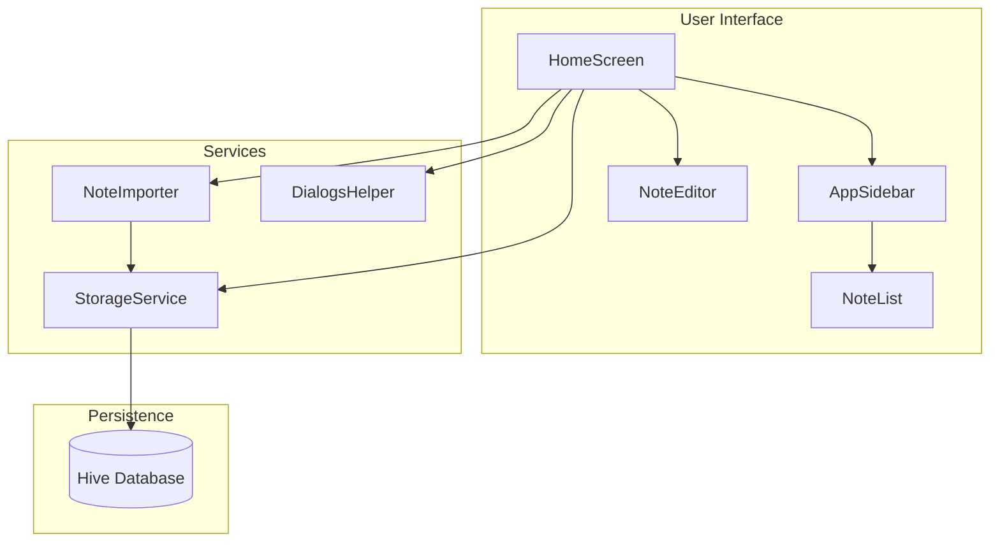

# Flutter Notes - Project Specification & Architectural Design Document

> **Version:** 1.0  
> **Last Updated:** January 9, 2026  
> **Purpose:** Source of Truth for AI-assisted feature implementations

---

## 1. System Overview

**Flutter Notes** is a lightweight, cross-platform desktop note-taking application designed to provide fast, offline-first note management with a minimalist two-panel interface. It leverages Hive for local persistence, enabling instant read/write operations without network dependencies. The core value proposition is simplicity and speed—users can create, search, and organize notes with keyboard-driven workflows while the app automatically persists changes via debounced auto-save.

---

## 2. Features & Functionality

### 2.1 Core Features

| Feature | Description |
|---------|-------------|
| **Create Notes** | Add new notes via toolbar button or `Ctrl+N` keyboard shortcut |
| **Edit Notes** | Two-field editor (title + body) with auto-save after 2 seconds of inactivity |
| **Delete Notes** | Delete individual notes with confirmation dialog, or via `Delete` key |
| **Delete All Notes** | Bulk delete all notes (hidden in "More options" menu) with confirmation |
| **Search Notes** | Full-text search across all note content |
| **Import Notes** | Import notes from JSON files (expects `activeNotes` array format) |
| **Unsaved Indicator** | Blue dot appears next to note title when changes are pending |

### 2.2 User Interface Layout

```
┌─────────────────────────────────────────────────────────────────┐
│  App Bar: [Title] [Add Note] [More Options ▼]                   │
├──────────────────────┬──────────────────────────────────────────┤
│  Left Panel (300px)  │  Right Panel (Flexible)                  │
│  ┌────────────────┐  │  ┌────────────────────────────────────┐  │
│  │ Search Field   │  │  │ Note Title (bold, 18px)      [ℹ]  │  │
│  ├────────────────┤  │  ├────────────────────────────────────┤  │
│  │ Note List      │  │  │                                    │  │
│  │ • Title        │  │  │ Note Body                          │  │
│  │   Preview      │  │  │ (expandable text area)             │  │
│  │ ────────────── │  │  │                                    │  │
│  │ • Title        │  │  │                                    │  │
│  │   Preview      │  │  │                                    │  │
│  └────────────────┘  │  └────────────────────────────────────┘  │
└──────────────────────┴──────────────────────────────────────────┘
```

### 2.3 Keyboard Shortcuts

| Shortcut | Action |
|----------|--------|
| `Ctrl+N` | Create a new note |
| `Delete` | Delete the selected note (shows confirmation) |

### 2.4 Note Metadata Dialog

Accessed via the info icon (ℹ) in the editor. Displays:
- **Created:** Date and time of note creation
- **Last Modified:** Date and time of last edit
- **Delete button:** Alternative way to delete the current note

---

## 3. Data Model

### 3.1 Note Structure

| Field | Description |
|-------|-------------|
| **ID** | Unique identifier (UUID) |
| **Content** | Full note text (first line = title, rest = body) |
| **Creation Date** | When the note was created |
| **Last Modified** | When the note was last edited |
| **Markdown** | Reserved flag for future markdown support |

### 3.2 Sorting & Display

- Notes are sorted by **creation date (newest first)**
- If creation dates match, sorted by **last modified (newest first)**
- List displays **title** (first line) and **preview** (remaining content, truncated)

---

## 4. Architecture Overview

### 4.1 Layer Diagram



### 4.2 Tech Stack

| Category | Technology |
|----------|------------|
| **Framework** | Flutter (Desktop) |
| **Database** | Hive (local key-value store) |
| **Window Management** | window_manager |
| **Single Instance** | windows_single_instance |
| **File Handling** | file_picker |

### 4.3 Storage Architecture

The app uses three separate Hive boxes for optimal performance:

| Storage | Purpose |
|---------|---------|
| **Notes Box** | Full note content (lazy-loaded) |
| **Metadata Box** | Lightweight note info for list display (always in memory) |
| **Settings Box** | User preferences (window position, selected note) |

---

## 5. Application Behavior

### 5.1 Startup Sequence

1. Ensure single instance (bring existing window to front if already running)
2. Initialize storage and run any pending migrations
3. Restore window position and size from last session
4. Load note list and restore last selected note

### 5.2 Auto-Save Behavior

1. User types in the editor
2. "Unsaved" indicator appears immediately
3. 2-second timer starts (resets on each keystroke)
4. After 2 seconds of inactivity, note is saved
5. "Unsaved" indicator disappears

### 5.3 Note Selection

1. Pending changes are saved before switching notes
2. Selected note ID is persisted to restore on next launch
3. Full note content is loaded only when selected (lazy loading)

### 5.4 Search Behavior

- Search is triggered on pressing Enter in the search field
- Searches full note content (case-insensitive)
- Results replace the note list until search is cleared
- Clearing search restores the full note list

---

## 6. Cross-Cutting Concerns

### 6.1 Window Management

- Window position and size are saved on every move/resize
- Restored automatically on app launch
- Single-instance enforcement: only one app window allowed

### 6.2 Data Migrations

The app automatically handles legacy data formats:

| Migration | When Applied |
|-----------|--------------|
| Legacy list format | Old single-list storage → individual notes |
| Integer keys | Numeric IDs → UUID strings |
| Window settings | Moved from notes box → settings box |

### 6.3 Performance Optimizations

- **Lazy loading:** Full note content loaded only when needed
- **Metadata index:** Fast list rendering without loading full notes
- **Scroll optimization:** Reduced scroll velocity, isolated repaints
- **Cache extent:** Pre-renders notes slightly outside viewport

---

## 7. Import/Export

### 7.1 Import Format

Supported JSON format:
```json
{
  "activeNotes": [
    {
      "id": "uuid",
      "content": "Note text",
      "creationDate": "ISO8601",
      "lastModified": "ISO8601"
    }
  ]
}
```

### 7.2 Export

**Not yet implemented.** (Future consideration)

---

## 8. File Organization

| Path | Purpose |
|------|---------|
| `lib/main.dart` | App entry point, initialization |
| `lib/models/` | Data models (Note, NoteMetadata) |
| `lib/screens/` | Main screen with app state |
| `lib/services/` | Storage, import, and helper services |
| `lib/widgets/` | Reusable UI components |

---

## 9. Developer Guidelines

### 9.1 Key Principles

1. **Flush before navigate:** Always save pending changes before switching notes or reloading
2. **Metadata for lists, full Note for editing:** Use lightweight metadata for display, load full content only when needed
3. **Guard listeners:** Prevent infinite loops when programmatically updating text fields
4. **Use const constructors:** Enable Flutter's widget optimization where possible
5. **Static services:** StorageService is a static singleton, never instantiated

### 9.2 Current Limitations

- No markdown rendering (flag exists but unused)
- No tags or categories
- No export functionality
- No cloud sync
- Search iterates all notes (no index)
- Minimal test coverage

---

## 10. Future Considerations

| Feature | Status |
|---------|--------|
| Markdown preview | Flag reserved, not implemented |
| Tags/Categories | Not started |
| Export to JSON | Not started |
| Cloud sync | Not started |
| Search indexing | Not started |
| Comprehensive tests | Minimal coverage |

---

*This document should be updated when features or architecture change.*
